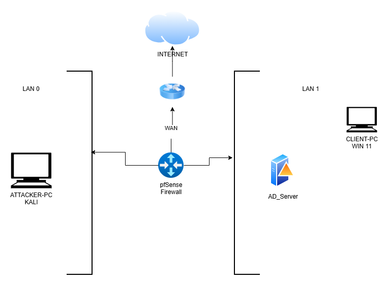

# 🚀 Cybersecurity Home Lab Project
A full virtualized enterprise-style environment designed for hands-on security, monitoring and administratiion practice

---

## 🔎 Overview
This project aimed to simulate a small enterprise network. it includes a firewall, domain controller, Windows endpoints, a SIEM, and a kali linux attack machine. The goal of this lab is to practise system administration, network security, monitoring, and incident detection in a controlled environment

---

## 🧱 Architecture & Components

| Component                | Technology                                          |
|--------------------------|-----------------------------------------------------|
| Virtualization Platform  | Oracle VirtualBox                                   |
| Firewall & Routing       | pfSense                                             |
| Directory Services       | Windows Server with Active Directory Domain Services |
| Endpoint Systems         | Windows 11 VM joined to the domain                  |
| Monitoring & Logging     | Sysmon installed on endpoints; logs forwarded to Splunk |
| Offensive Security Machine | Kali Linux VM                                       |

---
## Network Segementation Overview

 ### LAN 0- Attack Network
- Kali Linux is isolated for penetration testing, vulnerability scanning and simulating adversarial activity.
### LAN 1 - Production Network
- Hosts window client and AD server. it presents typical enterprise environment where Authentication, policies and endpoint activity occur.
### pfSense Firewall - Security and Routing Layer
- it sits between all network and internet, providing:
   - Netowork segement
   - Firewall rules
   - NAT
   - Traffic control
   - Isolation between attacker and production networks
##  What I Built
- Installled and configured VM as the virtualization platform
- Deployed **pfSense** and configured internal network, firewall rules and routing
- Installed **Window Server**, promoted it to a **Domain Controller** and configured:
   - Active Directory
   - Users, groups and Organizational Units
   - Group policies
  - Installed **Win 11**, joined it to the domain, and applied domain policies
  - Installed **Sysmon** with a modular configuration to generate detailed endpoint telemetry
  - Deployed **Splunk** on win 11 for log ingestion and analysis
  - Installed **Kali Linux** for Pen-testing and network assessement practice

  ---
##  Skills Demonstrated
- Virtualization & network segementation
- Firewall configuration & network troubleshooting
- Active Directory administration
- Endpoint hardening and monitoring
- SIEM setup and log analysis
- Understanding of enterprise-style network architecture
---
## What This Lab Enables
- Practicing detection of suspicious activity using Sysmon + Splunk
- Testing attacks from Kali Linux and analyzing logs
- Building and applying group policies
- Understanding how real-world networks are structured and secured
- Strengthening blue-team and red-team foundational skills
